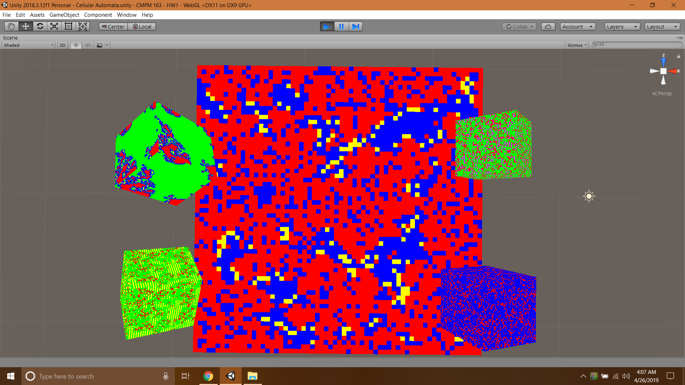

# CMPM163-HW1C
Cellular Automata

https://xbradley.github.io/CMPM163-HW1C/

## Types
Upper Left Cube:  Island Cellular Automata  
Upper Right Cube: Static with Vertical Line Effect  
Lower Left Cube:  Horizontal Line Automata  
Lower Right Cube: Static Effect   
Background:       Colorful Cellular Automata  

## Screenshots

